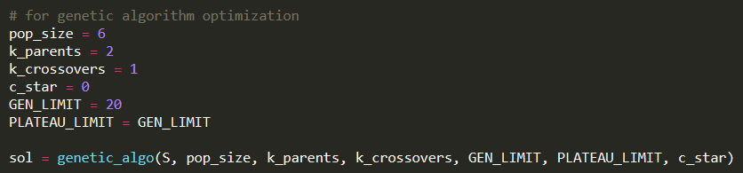

# Simulated annealing and Genetric Algorithm Optimization
 Simulated annealing and genetic algorithm optimization for number partioning problem

# background
Simulated annealing is a combinatorial optimization technique that was proposed by S. Kirkpatrick, C. D. Gelatt and M. P. Vecchi in the search for an algorithm performance beter than local optimzation. 

The solution here is based on the model proposed by JOHNSON, D. S., C. R. ARAGON, L. A. MCGEOCH AND C.
SCHEVON.

For more detailed information check the papers in the description. [2][3]

# use to install packages necessary

Although code uses only basic packages, you may need to install the right package versions

1. change directory to inside of the folder
2. pip install requirements.txt

# how to use

| filename | description|
|----------|------------|
| optimizations | the folder containing the optimization methods |
| optimizations/costs.py | the costs for the optimizations methods |
| genetic_algo | the folder containing the files pertaining to the genetic algorithm |
| genetic_algo/gen_algo.py | the file containing the main code for genetic algorithm |
| genetic_algo/mutations.py | the file containing code for the mutations used in the genetic algorithm |
| genetic_algo/selections.py | the file containing code for the selection methods used in the genetic algorithm |
| sim_annealing | the folder containing the files pertaining to the simulated annealing algorithm |
| sim_annealing/annealing.py | the file containing the annealing function |
| sim_annealing/schedules.py | the file containing the cooling schedule functions |
| testing.py | the file demonstrates how to use the sim_annealing function to perform simulated annealing for the number partioning problem |
| test_sim_annealing.py | unittests|

## example code

## example output

[1,1,1,-1,-1]

- The positive 1s representing one partition
- the negative 1s representig the other partition

## Genetic Algorithm

### Params

- S: the set of integers you want to have partitioned
- pop_size: the size of population
- k_parents: number of parents for a single child
- k_crossover: the number of points for crossover
- GEN_LIMIT: the number of generations allowed
- PLATEAU_LIMIT: the number of generations without an improvement allowed
- c_star: score to terminate program at

## Simulated Annealing

### Params

 - S: the set of integers you want to have partitioned
 - T: the starting temperature
 - k: the size of neigborhood. Currently only works for a neighborhood of 1 at the moment, param is created to allow for k=2 in the future
 - Sizefactor: the temperture length L to be k*SIZEFACTOR
 - Cutoff: to shorten the length L; cut it abruptly to save time
 - freeze_lim: maximum amount of times to be frozen during the annealing process
 - min_percent: ratio to determine when the annealing run is frozen or not

A more descriptive version can be seen in the documentation

### cooling schedules

For the cooling schedules there is documentation in the schedules.py to help choose the right parameters.
Currently there are 4 cooling schedules to choose from

1. exponential mutliplicative cooling
2. Logarithmical multiplicative cooling 
3. Linear multiplicative cooling
4. Non-Monotonic Adaptive Cooling

More description can be seen in the references[1] or documentation

# References
 
[1] What-when-how.com. A Comparison of Cooling Schedules for Simulated Annealing (Artificial Intelligence) .  website: [Link](http://what-when-how.com/artificial-intelligence/a-comparison-of-cooling-schedules-for-simulated-annealing-artificial-intelligence/#:~:text=Cooling%20Schedule%3A%20Temperature%20control%20method,transitions%20for%20each%20temperature%20value)

[2] JOHNSON, D. S., C. R. ARAGON, L. A. MCGEOCH AND C.
SCHEVON. 1989. Optimization by Simulated Annealing:
An Experimental Evaluation, Part I, Graph Partitioning.
Opns. Res. 37, 865-892.

[3] JOHNSON, D. S., C. R. ARAGON, L. A. MCGEOCH AND C.
SCHEVON. 1989. Optimization by Simulated Annealing:
An Experimental Evaluation, Part II, Graph Coloring and Number Partitioning.
Opns. Res. 37, 865-892.
