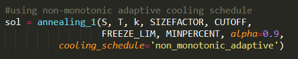

# Simulated_annealing
 Simulated annealing for number partioning problem

# background
Simulated annealing is a combinatorial optimization technique that was proposed by S. Kirkpatrick, C. D. Gelatt and M. P. Vecchi in the search for an algorithm performance beter than local optimzation. 

The solution here is based on the model proposed by JOHNSON, D. S., C. R. ARAGON, L. A. MCGEOCH AND C.
SCHEVON.

For more detailed information check the papers in the description. [2][3]

# how to use

| filename | description|
|----------|------------|
| annealing.py | the file containing the annealing function |
| schedules.py | the file containing the cooling schedule functions |
| testing.py | the file demonstrates how to use the sim_annealing function to perform simulated annealing for the number partioning problem |

## example code

## example output

[1,1,1,-1,-1]

- The positive 1s representing one partition
- the negative 1s representig the other partition

## Params
 - S: the set of integers you want to have partitioned
 - T: the starting temperature
 - k: the size of neigborhood. Currently only works for a neighborhood of 1 at the moment, param is created to allow for k=2 in the future
 - Sizefactor: the temperture length L to be k*SIZEFACTOR
 - Cutoff: to shorten the length L; cut it abruptly to save time
 - freeze_lim: maximum amount of times to be frozen during the annealing process
 - min_percent: ratio to determine when the annealing run is frozen or not

A more descriptive version can be seen in the documentation

## cooling schedules

For the cooling schedules there is documentation in the schedules.py to help choose the right parameters.
Currently there are 4 cooling schedules to choose from

1. exponential mutliplicative cooling
2. Logarithmical multiplicative cooling 
3. Linear multiplicative cooling
4. Non-Monotonic Adaptive Cooling

More description can be seen in the references[1] or documentation

# References
 
[1] What-when-how.com. A Comparison of Cooling Schedules for Simulated Annealing (Artificial Intelligence) .  website: [Link](http://what-when-how.com/artificial-intelligence/a-comparison-of-cooling-schedules-for-simulated-annealing-artificial-intelligence/#:~:text=Cooling%20Schedule%3A%20Temperature%20control%20method,transitions%20for%20each%20temperature%20value)

[2] JOHNSON, D. S., C. R. ARAGON, L. A. MCGEOCH AND C.
SCHEVON. 1989. Optimization by Simulated Annealing:
An Experimental Evaluation, Part I, Graph Partitioning.
Opns. Res. 37, 865-892.

[3] JOHNSON, D. S., C. R. ARAGON, L. A. MCGEOCH AND C.
SCHEVON. 1989. Optimization by Simulated Annealing:
An Experimental Evaluation, Part II, Graph Coloring and Number Partitioning.
Opns. Res. 37, 865-892.
